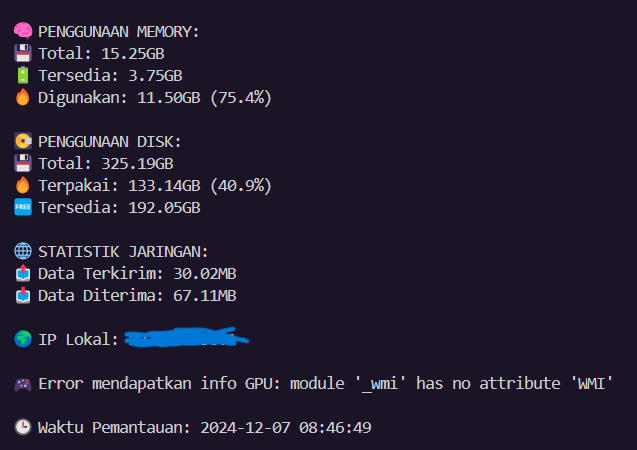
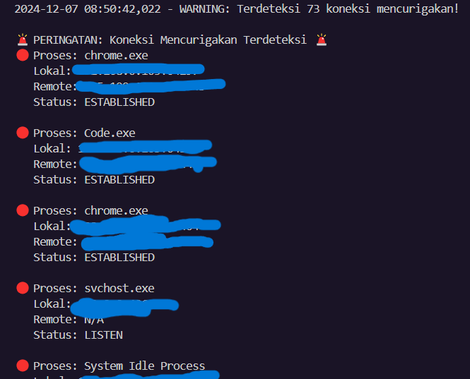

# 🌐 Sistem Monitoring Jaringan dan Local Device

## 📋 Ringkasan Proyek

Sistem Monitoring Jaringan ini adalah alat berbasis Python, dirancang untuk memberikan pemantauan tentang infrastruktur jaringan, kesehatan perangkat, dan konektivitas WiFi. Dengan memanfaatkan teknik monitoring ini, menawarkan analisis real time dan pelaporan dari metrik terkait jaringan.

## ✨ Fitur Utama

### 🖥️ Monitoring Sistem
- Pelacakan sumber sistem (CPU, Memori, Disk)
- Pengambilan informasi sistem spesifik platform
- Pencatatan dan analisis performa

### 🌐 Inteligensia Jaringan
- Pemindaian antarmuka jaringan
- Resolusi alamat IP dan hostname
- Pemetaan status koneksi dan topologi jaringan
- Deteksi dan analisis jaringan WiFi

### 🔒 Keamanan & Logging
- Mekanisme logging yang bagus
- Pemindaian jaringan berbasis keamanan
- Pemrosesan konkuren untuk monitoring efisien
- Integrasi database SQLite untuk penyimpanan data persistem

## 🛠️ Teknologi yang Digunakan

- **Bahasa**: Python 3.8+
- **Library Utama**:
  - `psutil`: Utilitas sistem dan proses
  - `platform`: Pengambilan informasi sistem
  - `socket`: Komunikasi jaringan
  - `threading`: Operasi konkuren
  - `sqlite3`: Manajemen database
  - `requests`: Networking HTTP
 
   **WAJIB DI INSTALL!**

## 🚀 Prasyarat

- Python 3.8 atau lebih tinggi
- Library Python yang dibutuhkan (lihat `Eksternal Tools`)
- Akses administratif/root direkomendasikan

## 🔧 Instalasi Clone

```bash
https://github.com/rexzea/Simple-Monitoring.git
```


## 📊 Eksternal tools

```python
import psutil
import platform
import socket
import time
import logging
import datetime
import socket
import json
import threading
import time
import sqlite3
import re
import os
import subprocess
import concurrent.futures
import uuid
import requests
import ipaddress

```

## 🔧 Preview
```bash
--- Monitoring Jaringan ---
Jaringan: {'ssid': 'Kepo lu', 'platform': 'Windows'}
Perangkat Terhubung: 0
Kecepatan Download: 18.81 Mbps
Kecepatan Upload: 9.4 Mbps
Kekuatan Sinyal: 84%
IP Lokal: kepo lu
Subnet: kepo lu
Daftar Perangkat: kepo lu
Monitoring dihentikan.
```




## 🔍 Cara Kerja

Proyek ini menggunakan teknik pemrograman konkuren untuk:
- Memantau performa sistem secara real time
- Mengumpulkan data jaringan dari berbagai sumber
- Menganalisis konektivitas dan kinerja jaringan
- Menyimpan dan melaporkan temuan dalam format yang mudah buat dibaca

## 🛡️ Keamanan

- Implementasi logging yang aman
- Deteksi potensi ancaman jaringan
- Perlindungan data yang sensitif
- Pemantauan akses

## 🤝 Kontribusi

Silakan untuk berkontribusi lalu melakukan Pull Request! 

## 📄 Lisensi

[@Rexzea]

## 🏆 Pengakuan
cr : Rexzea

---

**Disclaimer**: Gunakan dengan bertanggung jawab dan pastikan mematuhi kebijakan jaringan lokal dan regulasi yang berlaku.
